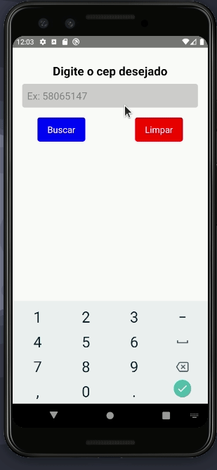

# Buscar Cep

*Esta é uma aplicação mobile desenvolvida em react native que exibe para o usuário as informações do cep buscado.*

*Como funciona esta aplicação:*

##### * Ao pressionar o botão "buscar", a aplicação irá fazer uma requisição para a api do <a href="https://viacep.com.br/" target="_blank" >Via_Cep</a> e mostrará na tela as informações de um determinado cep buscado pelo usuário, onde serão exibidos o nome do logradouro, o bairro, a cidade e o Estado. Apertando no botão "Limpar", o input será zerado e o teclado aparecerá para que o usuário possa digitar novamente um cep.  
 

# Techs :

### * React Native
 
 

<h1 align="center">
    
</h1>